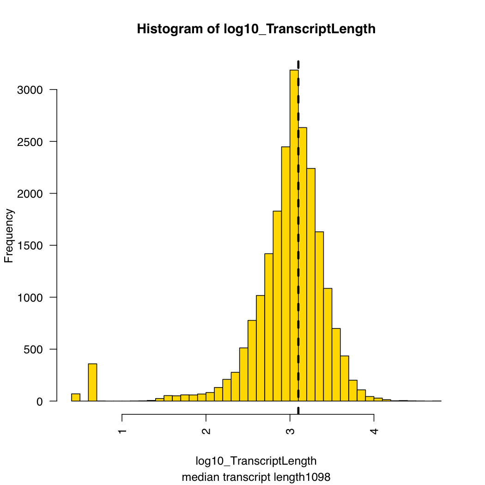
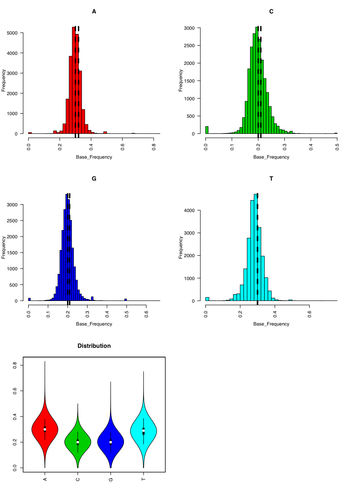

## Basic Statistics C elegans transcriptome model 
> C.elegans.Aggregate_1003_genes_sorted_oriented_ERCC92.fa

#### 21774 clones in the c elegans transcriptome 
      grep '>' Aggregate_1003_genes_sorted_oriented_ERCC92.fa | wc -l
21866 -92 = 21774

#### 92 ERCC-s are there
      grep 'ERCC-' Aggregate_1003_genes_sorted_oriented_ERCC92.fa | wc -l

### Count bases per transcript
inputdir = ""
inputfile = ""

`cd /Users/abelvertesy/Downloads/`
`awk '{ print length($0); }' C.elegans.Aggregate_1003_genes_sorted_oriented_ERCC92.fa > Length.txt`

... Manual removal of ERCC genes


`grep ">" C.elegans.Aggregate_1003_genes_sorted_oriented_ERCC92.fa > ListOfTranscripts.C.elegans.txt`

### Process

```R
path_of_report = "/Users/abelvertesy/Github_repos/TheCorvinas.wiki/Biology/Sequencing/C_elegans_reference_transcriptome_statistics/C_elegans_reference_transcriptome_statistics.md"

TranscriptLength.hg19 = read.simple.tsv.named.vector("/Users/abelvertesy/Github_repos/TheCorvinas/Mapping/Reference_Stats/hg19/TranscriptLength.hg19.tsv")
OutDir = "/Users/abelvertesy/Github_repos/TheCorvinas/Mapping/Reference_Stats/hg19/"
whist(TranscriptLength.hg19, breaks = 50)

log10_TranscriptLength.hg19 = log10(TranscriptLength.hg19)
whist(log10_TranscriptLength.hg19, breaks = 50, vline = log10(c(1977,2234)))
round(10^(summary(log10_TranscriptLength.hg19)))

```

     Min. 1st Qu.  Median    Mean 3rd Qu.    Max. 
      3     655    1099     948    1750   56624 




####  Small gene name categories (length < 10)

| |   |
| ---| --- |
| RIT1M 	| 12  |
| RIT1P 	| 12  |
| RIT2M 	| 22  |
| RIT2P 	| 18  |
| RIT3M 	| 12  |
| RIT3P 	| 11  |
| RIT4M 	| 30  |
| RIT4P 	| 32  |
| RIT5M 	| 98  |
| RIT5P 	| 100  |
| RIT6M 	| 43  |
| RIT6P 	| 38  |
| C27C7.2 	| 1  |
| F47G4.8 	| 1  |


#### Code 

```R
TranscriptLength = read.simple.tsv.named.vector("/Users/abelvertesy/Github_repos/TheCorvinas.wiki/Biology/Sequencing/C_elegans_reference_transcriptome_statistics/Length.C_elegans.transcripts.vec")   
whist(TranscriptLength, breaks = 50)

log10_TranscriptLength = log10(TranscriptLength)
median(TranscriptLength)

subb = kollapse("median transcript length", median(TranscriptLength))
whist(log10_TranscriptLength, breaks = 50, vline = log10(median(TranscriptLength)), sub=subb)
round(10^(summary(log10_TranscriptLength)))


l(which_names(TranscriptLength<10))
idx = which(TranscriptLength<10)

nz = names(TranscriptLength[idx])
xx=stringr::str_split_fixed(nz, pattern = '\\.', n=2)[,1]

zz = table(substr(xx,4,10))
names(zz) = paste0("RIT",names(zz))
zz =t(t(zz))
path_of_report = "/Users/abelvertesy/Github_repos/TheCorvinas.wiki/Biology/Sequencing/C_elegans_reference_transcriptome_statistics/C_elegans_reference_transcriptome_statistics.md"
MarkDown_Table_writer_DF_RowColNames(zz)

```


### Base Frequencies in the transcripts





### Code to calculate Base Frequencies

```R
llprint("### Base Frequencies in the transcripts")

names_ = read.simple.vec("/Users/abelvertesy/Github_repos/TheCorvinas.wiki/Biology/Sequencing/C_elegans_reference_transcriptome_statistics/ListOfTranscripts.C.elegans.vec")
any.duplicated(make.names(names_))

BaseFrequencies= read.simple.tsv("/Users/abelvertesy/Github_repos/TheCorvinas.wiki/Biology/Sequencing/C_elegans_reference_transcriptome_statistics/BaseFrequencies.C.elegans.tsv")
OutDir = "/Users/abelvertesy/Github_repos/TheCorvinas.wiki/Biology/Sequencing/C_elegans_reference_transcriptome_statistics/"

pname=  "Basedistr"
pdfA4plot_on(pname = pname, rows = 3, cols = 2, mdlink = T)

Bases = c("A","C","G","T" )
for (L in 1:l(Bases)) {
  base=Bases[L]; print(base)
  
  Base_Frequency = BaseFrequencies[,base]
  linez = iround(c(mean(Base_Frequency), median(Base_Frequency)))
  whist(Base_Frequency, breaks = 50, vline = linez, col=L+1, savefile = F, main = base)
  print (quantile(Base_Frequency, probs = c(.05,.95)))
}

Distribution = splitByCol(BaseFrequencies, f = Bases)
wvioplot_list(Distribution, savefile = F)
pdfA4plot_off()


llprint("### Code to calculate Base Frequencies")


```
