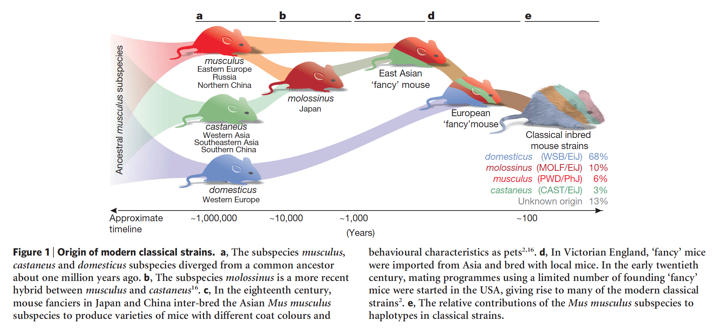

# Mice Strains

Frazer, K. A., Eskin, E., Kang, H. M., Bogue, M. A., Hinds, D. A., Beilharz, E. J., … Cox, D. R. (2007). **A sequence-based variation map of 8.27 million SNPs in inbred mouse strains.** Nature, 448(7157), 1050–1053. http://doi.org/10.1038/nature06067

|  	| CAST/EiJ 	| MOLF/EiJ 	| PWD/PhJ 	| WSB/EiJ 	| 129S1/SvImJ 	| A/J 	| AKR/J 	| BALB/cByJ 	| BTBR T+tf/J 	| C3H/HeJ 	| DBA/2J 	| FVB/NJ 	| KK/HIJ 	| NOD/LtJ 	| NZW/LacJ 	| C57BL/6J |
|---|---|---|---|---|---|---|---|---|---|---|---|---|---|---|---|---|
| CAST/EiJ 	| 0 	| 2933369 	| 3150514 	| 3224061 	| 3434002 	| 3505117 	| 3441579 	| 3481318 	| 3437597 	| 3411259 	| 3429474 | 3436442 	| 3413765 	| 3424794 	| 3420744 	| 3735765 |
| MOLF/EiJ 	| 2933369 	| 0 	| 1706620 	| 3631083 	| 3469294 	| 3612933 	| 3553500 	| 3594068 	| 3508068 	| 3485051 	| 3465296 | 3586754 	| 3356764 	| 3519141 	| 3386992 	| 3759287 |
| PWD/PhJ 	| 3150514 	| 1706620 	| 0 	| 3582604 	| 3474063 	| 3607058 	| 3554997 	| 3584361 	| 3507987 	| 3463433 	| 3451264 | 3594846 	| 3359652 	| 3530695 	| 3390349 	| 3797752 |
| WSB/EiJ 	| 3224061 	| 3631083 	| 3582604 	| 0 	| 1397793 	| 1350602 	| 1333161 	| 1329037 	| 1376675 	| 1348192 	| 1391221 | 1259979 	| 1543867 	| 1342950 	| 1501334 	| 1523063 |
| 129S1/SvImJ 	| 3434002 	| 3469294 	| 3474063 	| 1397793 	| 0 	| 961441 	| 1005015 	| 921623 	| 704523 	| 925132 	| 991001 | 959390 	| 1062764 	| 997774 	| 963362 	| 1080788 |
| A/J 	| 3505117 	| 3612933 	| 3607058 	| 1350602 	| 961441 	| 0 	| 710254 	| 468574 	| 894527 	| 545436 	| 864489 	| 758547 	| 1120917 	| 833455 	| 1081133 	| 1039717 |
| AKR/J 	| 3441579 	| 3553500 	| 3554997 	| 1333161 	| 1005015 	| 710254 	| 0 	| 716100 	| 911383 	| 744423 	| 874150 | 817333 	| 1096293 	| 802300 	| 1068359 	| 1039568 |
| BALB/cByJ 	| 3481318 	| 3594068 	| 3584361 	| 1329037 	| 921623 	| 468574 	| 716100 	| 0 	| 887783 	| 609910 	| 813146 | 783906 	| 1113874 	| 849421 	| 1070472 	| 953569 |
| BTBR T+tf/J 	| 3437597 	| 3508068 	| 3507987 	| 1376675 	| 704523 	| 894527 	| 911383 	| 887783 	| 0 	| 920555 	| 975228 | 890484 	| 1037423 	| 926374 	| 1042854 	| 922916 |
| C3H/HeJ 	| 3411259 	| 3485051 	| 3463433 	| 1348192 	| 925132 	| 545436 	| 744423 	| 609910 	| 920555 	| 0 	| 686431 | 819124 	| 1115888 	| 879529 	| 1075257 	| 1031950 |
| DBA/2J 	| 3429474 	| 3465296 	| 3451264 	| 1391221 	| 991001 	| 864489 	| 874150 	| 813146 	| 975228 	| 686431 	| 0 	| 921938 	| 1107898 	| 951392 	| 1087983 	| 1091388 |
| FVB/NJ 	| 3436442 	| 3586754 	| 3594846 	| 1259979 	| 959390 	| 758547 	| 817333 	| 783906 	| 890484 	| 819124 	| 921938 	| 0 	| 1048336 	| 724993 	| 1037769 	| 1008836 |
| KK/HIJ 	| 3413765 	| 3356764 	| 3359652 	| 1543867 	| 1062764 	| 1120917 	| 1096293 	| 1113874 	| 1037423 	| 1115888 	| 1107898 	| 1048336 	| 0 	| 1050930 	| 1049990 	| 1198695 |
| NOD/LtJ 	| 3424794 	| 3519141 	| 3530695 	| 1342950 	| 997774 	| 833455 	| 802300 	| 849421 	| 926374 	| 879529 	| 951392 	| 724993 	| 1050930 	| 0 	| 1056996 	| 1057831 |
| NZW/LacJ 	| 3420744 	| 3386992 	| 3390349 	| 1501334 	| 963362 	| 1081133 	| 1068359 	| 1070472 	| 1042854 	| 1075257 	| 1087983 	| 1037769 	| 1049990 	| 1056996 	| 0 	| 1177909 |
| C57BL/6J 	| 3735765 	| 3759287 	| 3797752 	| 1523063 	| 1080788 	| 1039717 	| 1039568 	| 953569 	| 922916 	| 1031950 	| 1091388 	| 1008836 	| 1198695 	| 1057831 	| 1177909 	| 0 |
