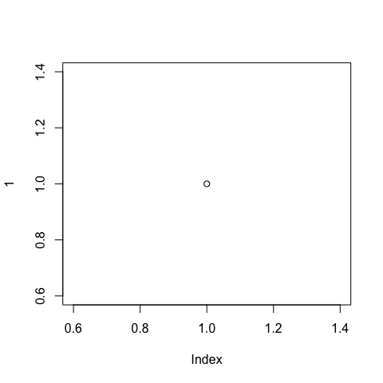

```r
# output: html_document
# output: pdf_document
# output: word_document
```

# Homework 12 - Web scraping and APIs
Dean Attali
Nov 29 2014

Last updated: 2018-08-03 15:54:57

## Overview
I wanted to see if there's any relationship between the amount of money
a country spends on research and development (R&D) and the number of Nobel
Prize laureates produed by the country.
I expect that there is such a relationship to some extent. While money spent
on R&D does not necessarily mean the money is going towards science-based R&D
for example, it can


```r
# try.dev.off()
MyGauss = rnorm(1000)
hist(MyGauss, col = "gold1")
```

<!-- -->

```r
MyPoiss = rpois(1000, lambda = 7)
hist(MyPoiss, col = "gold1")
```

<!-- -->

```r
plot(cars)
```

<!-- -->

```r
plot(1)
```

<!-- -->

asas
sasa
sa
s

---
title: "CompileMe.R"
author: "abelvertesy"
date: "Fri Aug  3 15:54:56 2018"
---
